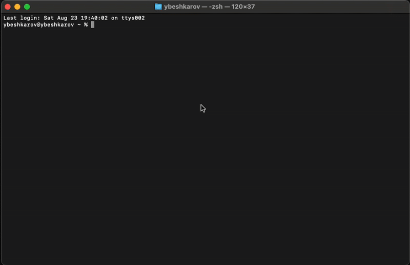

[](https://pub.dev/packages/smf_flutter_cli)
[](LICENSE)

# SMF Flutter CLI

A comprehensive Flutter CLI tool for scaffolding and configuring Flutter applications with modular architecture.

## Overview

SMF Flutter CLI is a powerful command-line interface that helps developers quickly scaffold Flutter applications with pre-configured modules, dependencies, and best practices. It provides a modular approach to Flutter project generation, allowing developers to select only the components they need.

## Features

- 🚀 **Rapid Project Scaffolding**: Generate Flutter projects with pre-configured modules
- 🧩 **Modular Architecture**: Select and configure only the modules you need
- 🔧 **Smart Dependency Management**: Automatic dependency resolution and configuration
- 📱 **Flutter Best Practices**: Built-in templates following Flutter development standards
- 🔥 **Firebase Integration**: Seamless Firebase setup and configuration
- 🛣️ **Routing Solutions**: Multiple routing options including GoRouter
- 📊 **Analytics Ready**: Built-in analytics and tracking capabilities
- 🎯 **Customizable Templates**: Extensible brick-based template system

## Install
```bash
dart pub global activate smf_flutter_cli
smf --version
```

## Quick start

Interactive (you will be prompted for missing values):
```bash
smf create my_app
```



```bash
A CLI tool by Say My Frame

Usage: smf <command> [arguments]

Global options:
-h, --help       Print this usage information.
    --verbose    Enable verbose logging.
-v, --version    Print the current CLI version.

Available commands:
  create   Create flutter app

Run "smf help <command>" for more information about a command.
```

Non-interactive (fully scripted):
```bash
smf create my_cli_test_app \
  -m firebase_analytics,home,get_it,go_router \
  --route /home \
  --org com.saymyframe
```

## Available Modules

- **Core Flutter**: Basic Flutter project structure and configuration
- **Firebase Core**: Firebase initialization and basic setup
- **Analytics**: Analytics and tracking integration
- **GoRouter**: Advanced routing with GoRouter
- **GetIt**: Dependency injection with GetIt
- **Communication**: Inter-module communication patterns
- **Home Flutter**: Home screen and navigation templates

## Development

This is a monorepo managed with Melos. To contribute:

```bash
# Install dependencies
melos bootstrap
```

## License

Copyright 2025 SayMyFrame. All rights reserved.

Licensed under the Apache License, Version 2.0 (the "License");
you may not use this file except in compliance with the License.
You may obtain a copy of the License at

    http://www.apache.org/licenses/LICENSE-2.0

Unless required by applicable law or agreed to in writing, software
distributed under the License is distributed on an "AS IS" BASIS,
WITHOUT WARRANTIES OR CONDITIONS OF ANY KIND, either express or implied.
See the License for the specific language governing permissions and
limitations under the License.

## Contributing

We welcome contributions! Please see our [Contributing Guide](CONTRIBUTING.md) for details.

## Support

- 📧 Email: support@saymyframe.com
- 🐛 Issues: [GitHub Issues](https://github.com/saymyframe/smf_flutter_cli/issues)
- 📖 Documentation: [SayMyFrame Docs](https://saymyframe.com)
